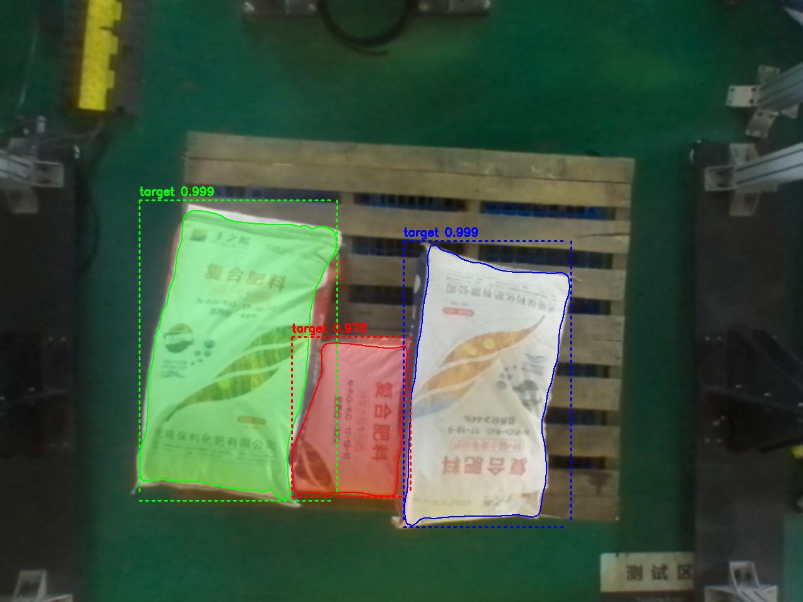

# OnnxDeploy

Overview: This code repository is designed for C++ deploying onnx models. The model inference is implemented based on onnxruntime. Due to the API incompatibility between different versions of onnxruntime, currently this version only supports running on onnxruntime 1.12.1.

## Requirements

This repository currently requires onnxruntime 1.12.1. Therefore, in order to run the code on GPU, you need to satisfy the following dependencies:

|  ONNXRuntime  |   CUDA  |  cuDNN  |                                Notes                               |
|:------------:|:-------:|:-------:|:------------------------------------------------------------------:|
|     1.12     |   11.4  |   8.2.4(linux) <br> 8.2.2.26(windows)  |   Linux (libcudart 11.4.43, libcufft 10.5.2.100, libcurand 10.2.5.120, libcublasLt 11.6.5.2, libcublas 11.6.5.2, and libcudnn 8.2.4) <br>  Windows (libcudart 11.4.43, libcufft 10.5.2.100, libcurand 10.2.5.120, libcublasLt 11.6.5.2, libcublas 11.6.5.2, and libcudnn 8.2.4) |

Note: Among the listed dependencies, cuDNN is backward compatible. Therefore, the version of cuDNN mentioned in the requirement table represents the minimum compatible version. It is possible to use higher compatible versions of cuDNN with the code. However, for optimal performance, it is recommended to use the exact version mentioned in the table.

Currently, pre-compiled libraries of onnxruntime 1.12.1 for different platforms are available on the release page, which can be directly downloaded and placed in third-party files for use. For further information on compatibility with other versions of onnxruntime, please refer to the following link: [OnnxRuntime Compatibility](https://onnxruntime.ai/docs/execution-providers/CUDA-ExecutionProvider.html).

## Detection Example

Here are two example segmentation results using the Mask R-CNN model:

1. Sack Segmentation: 

   In this example, the Mask R-CNN model accurately detects and segments sacks in an image. The model precisely identifies the boundaries of the sacks, providing detailed segmentation masks. This capability is useful in various industries, such as agriculture, construction, and logistics, where the segmentation of sacks is crucial for inventory management, quality control, and object recognition tasks.

2. Box Segmentation: 

   In this example, the Mask R-CNN model demonstrates effective box segmentation. The model accurately detects and outlines the boxes, providing detailed segmentation masks. This capability is valuable in various fields, including packaging, shipping, and automated sorting systems.

These results showcase the robustness and accuracy of the Mask R-CNN model in segmenting different object instances, such as sack and carton boxes. The model's precise segmentation enables precise object detection and identification, opening up possibilities for numerous real-world applications

## Usuage Guide

This section describes how to use the project, step by step.

1. Deploy CUDA and cuDNN environments based on requirements (only necessary when GPU execution is required).

2. Clone this repository and download the onnxruntime library for the corresponding platform from the release page, then place it in the third-party folder.
   
3. Install OpenCV. Make sure OpenCV is installed before compiling the library.

4. Launch the terminal in the root directory and run the following commands:

```
sudo mkdir build && cd build
cmake .. && make -j4
```
Alternatively, you can use an IDE such as VSCode or CLion instead to execute CMake build and compile.

4. The compiled executable and library outputs can be found in folder `version_*`.

Note: The ModelPredict library relies on the onnxruntime 1.12.1 inference engine for execution. For detailed information about the library's APIs, please refer to [page](./Doxygen/html/index.html).

## Contributing

Contributions are welcome for this repository. Fork the repository, make your changes, and submit a pull request. Please ensure that your changes are compatible with onnxruntime version 1.12.1.

## License

This code is licensed under the Apache 2.0 license. See the LICENSE file for details.